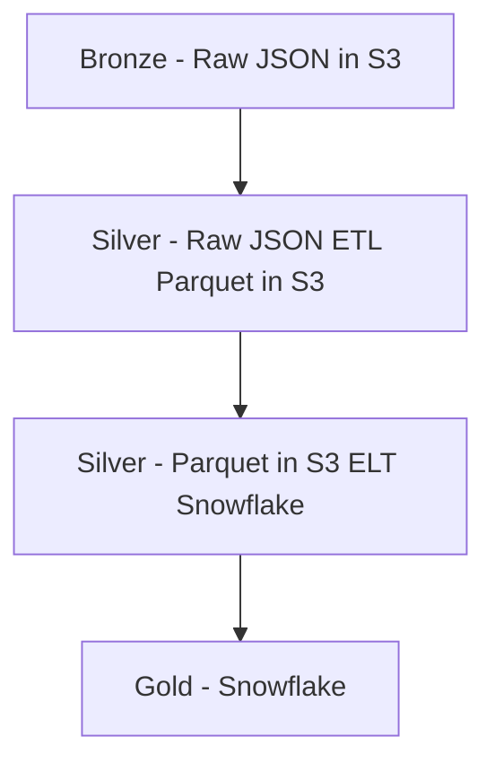

# snowflake

This repository will house all the configuration, and data exploration of data that will be often executed.  Configurations include warehouse, database, schema, table, user, role and other configurations. The managed access of snowflake will be governed by [RBAC](https://medium.com/snowflake/managed-access-schema-framework-in-rbac-1b63341be418)

## Connecting to Snowflake

> [!IMPORTANT]
> The Sage snowflake overlords see all, please make sure you are careful with your queries.  Always use `limit` when you are exploring tables!

Follow the steps below to get access to snowflake: https://mqzfhld-vp00034.snowflakecomputing.com

1. Ask internally at Sage for snowflake access.  You are permitted to explore in the UI, but long standing views and tables should be created via PR and will be created via the SYSADMIN role by users that can assume the sysadmin privilege.
1. Enable vscode snowflake extension. Follow instructions here https://docs.snowflake.com/en/user-guide/vscode-ext.  Note: the worksheets that you create in snowflake do not automatically get transfered into github, so we encourage using this extension to add version control to your SQL.
1. Follow the instructions in the vscode extension to connect to snowflake.  I recommend setting up your ~/.snowflake/config file.
1. Look at examples in the analytics/exploration.sql to see how you can query the warehouse.

## Contributing

If there is a query you expect to run frequently, lets contribute it to the analytics folder!


## Administration

For snowflake administrators, please make sure you read this carefully: https://docs.snowflake.com/en/user-guide/security-access-control-overview. All admin specific activities will be done in the [admin](admin) folder.  Admin activities include:

* Database creation
* Governance policies for schemas
* Role creation and granting of policies
* Oauth creation
* User creation
* Warehouse creation

### User/Role Management
Users and roles are to be created by the `USERADMIN`, and the code is contained in [here](admin/user_setup.sql).  To add a user, simple add their Sage Bionetworks email, the setup for google saml is included in the SQL command.

```
CREATE USER "...@sagebase.org"
```

### Warehouses/databases

Warehouse and databases _must be_ created by the `SYSADMIN` role. Different roles can be created for different projects so that certain users have permissions to create schemas and tables under this role. That said, currently it's easiest to have the `SYSADMIN` role also create many of the schemas and tables to ensure the correct security policies are set.

### Terraform exploration

Be sure to export these local variables and run the terraform script in the admin folder
```
export TF_VAR_snowflake_user=
export TF_VAR_snowflake_pwd=
export TF_VAR_snowflake_account=
```

## Synapse Data Warehouse (PoC)

### Data Architecture

This is just prototype, but I am going to attempt to follow the [medallion data architecture](https://www.databricks.com/glossary/medallion-architecture). That said, AWS glue does is an awkward in-between state of bronze and silver layer. The data warehouse data exposed as "raw" tables in snowflake does not correspond to the source system table structures, but is already transformed.



## RECOVER (PoC)

The RECOVER data is processed via AWS and is compressed to parquet datasets.  The parquet datasets are then ingested into snowflake for easy querying and validation.

## GENIE (PoC)

The GENIE public releases are loaded into snowflake via this [script](admin/genie_elt.py).  You must have a snowflake connection section, please copy and fill out this [template](.env_template) with your username and password.
