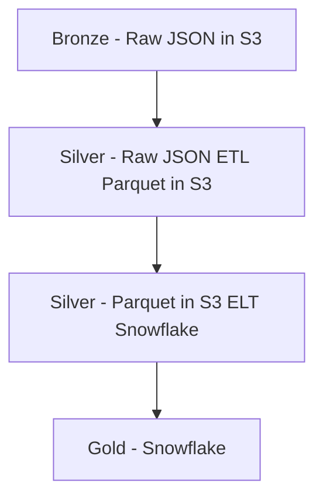

# snowflake

This repository will house all the configuration, and data exploration of data that will be often executed.  Configurations include warehouse, database, schema, table, user, role and other configurations.

## Connecting to Snowflake

> [!IMPORTANT]
> The Sage snowflake overlords see all, please make sure you are careful with your queries.  Always use `limit` when you are exploring tables!

Follow the steps below to get access to snowflake: https://mqzfhld-vp00034.snowflakecomputing.com

1. Ask internally at Sage for snowflake access.  You are permitted to explore in the UI, but long standing views and tables should be created via PR and will be created via the SYSADMIN role by users that can assume the sysadmin privilege.
1. Enable vscode snowflake extension. Follow instructions here https://docs.snowflake.com/en/user-guide/vscode-ext.  Note: the worksheets that you create in snowflake do not automatically get transfered into github, so we encourage using this extension to add version control to your SQL.
1. Follow the instructions in the vscode extension to connect to snowflake.  I recommend setting up your ~/.snowflake/config file.
1. Look at examples in the analytics/exploration.sql to see how you can query the warehouse.

## Contributing

If there is a query you expect to run frequently, lets contribute it to the analytics folder!

## Administration

Please refer to the [admin README](admin/README.md) for detailed information.

## Synapse Data Warehouse

### Data Architecture

This is just prototype, but I am going to attempt to follow the [medallion data architecture](https://www.databricks.com/glossary/medallion-architecture). That said, AWS glue provides an in-between state of bronze and silver layer. The data warehouse data exposed as "raw" tables in snowflake does not correspond to the source system table structures, but is already transformed.



### Roles and grants

Privileges within the data warehouse are managed according to the design outlined in the design doc [here](https://sagebionetworks.jira.com/wiki/spaces/DPE/pages/3829006353/Synapse+Data+Warehouse+Role+Hierarchy#Role-Hierarchy). The aspect of privilege management most relevant to contributors is that if you are introducing a new object type to a namespace (for example, an instance of an `EXTERNAL TABLE` into a schema which doesn't yet have any `EXTERNAL TABLE` objects), _you_ are responsible for setting up privilege management of that object type, following the already established model. More specifically, responsibilities entail:

* Granting ownership of this object type to the relevant `*_ALL_ADMIN` database role. See [here](https://github.com/Sage-Bionetworks/snowflake/pull/104/files#diff-d23e4b75e1cfeaf9ee3bf2f274210e62505eb30c14fdc86f985cf625d04de928R513-R542) for an example.
* Creating the necessary object-type-specific database role(s) and granting them appropriate privileges upon the object type. The general rule here is to create a single database role `{database}.{schema}_{object_type}_READ` (see [here](https://docs.snowflake.com/en/sql-reference/sql/grant-privilege) for a complete list of object types) and grant that role read-only privileges so that non-owners are able to see the object but not modify it. Rarely, there may be additional use-cases, or this object type might not have mere read-type privileges that can be even be granted upon it (the PROCEDURE object, a.k.a. stored procedures, being a common example), which may necessitate additional database roles or differently assigned privileges. See [here](https://github.com/Sage-Bionetworks/snowflake/pull/107/files#diff-d23e4b75e1cfeaf9ee3bf2f274210e62505eb30c14fdc86f985cf625d04de928R520-R539) for an example of read-type privileges being granted to object-type-specific database roles.
* Granting ownership and usage of the above database role(s) to the appropriate aggregator database role(s). See [here](https://github.com/Sage-Bionetworks/snowflake/pull/107/files#diff-a2c8db7044dc7f329368172c8b620bd8b08a2ade6a8ee2fe9629bf4b924286eaR4-R26) for an example of the creation and granting of ownership and usage privileges on object-type-specific database roles.
* Granting appropriate privileges on future objects (via future grants) to admin/analyst/developer database roles. See [here](https://github.com/Sage-Bionetworks/snowflake/pull/107/files#diff-eda3321a2afcec5ae10699543d6a5bf24617fc8eca196ede71f94322d29a5ee5R3-R22) for an example of granting future read-type privileges to their respective object-type-specific database roles. A similar process can be followed for granting ownership privileges on future objects to the appropriate `*_ALL_ADMIN` database role.

Fortunately, because of the rigorous privilege management performed during the initial deployment of an object-type, there is unlikely to be any privilege management required for deploying object-types which already exist within a namespace. Each user archetype – represented by the namespace-specific admin, developer, and analyst account roles – will inherit their archetype-tailored privileges for that object-type from preexisting database roles. One exception that could potentially occur is if your object has special privacy considerations, such as a field in a table which should only be visible to specific users. These objects will need their privileges handled on a case-by-case basis, although the general practice of granting privileges to a namespace-specific database role still applies.

## RECOVER (PoC)

The RECOVER data is processed via AWS and is compressed to parquet datasets.  The parquet datasets are then ingested into snowflake for easy querying and validation.


## Portals data (PoC)

snowflake, synapseclient and dotenv must be installed as dependencies.

```
pip install "snowflake-connector-python[pandas]" "synapseclient[pandas]" python-dotenv
```

## Contributing

For contribution guidelines, please see the `CONTRIBUTING.md` file in this repository.

## Visualizing with Streamlit

Users can customize their own data visualization dashboards from the data available on Snowflake by using the [streamlit-snowflake-template](https://github.com/Sage-Bionetworks/streamlit-snowflake-template). This is a template repository that leverages [Streamlit](https://streamlit.io/) to create and deploy internal applications for Synapse-derived data insight and analysis.
