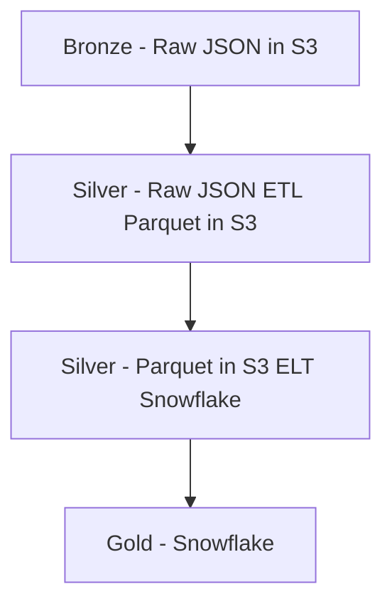

# snowflake

This repository will house all the configuration, and data exploration of data that will be often executed.  Configurations include warehouse, database, schema, table, user, role and other configurations.

## Connecting to Snowflake

> [!IMPORTANT]
> The Sage snowflake overlords see all, please make sure you are careful with your queries.  Always use `limit` when you are exploring tables!

Follow the steps below to get access to snowflake: https://mqzfhld-vp00034.snowflakecomputing.com

1. Ask internally at Sage for snowflake access.  You are permitted to explore in the UI, but long standing views and tables should be created via PR and will be created via the SYSADMIN role by users that can assume the sysadmin privilege.
1. Enable vscode snowflake extension. Follow instructions here https://docs.snowflake.com/en/user-guide/vscode-ext.  Note: the worksheets that you create in snowflake do not automatically get transfered into github, so we encourage using this extension to add version control to your SQL.
1. Follow the instructions in the vscode extension to connect to snowflake.  I recommend setting up your ~/.snowflake/config file.
1. Look at examples in the analytics/exploration.sql to see how you can query the warehouse.

## Contributing

If there is a query you expect to run frequently, lets contribute it to the analytics folder!

## Administration

Please refer to the [admin README](admin/README.md) for detailed information.

## Synapse Data Warehouse

### Data Architecture

This is just prototype, but I am going to attempt to follow the [medallion data architecture](https://www.databricks.com/glossary/medallion-architecture). That said, AWS glue provides an in-between state of bronze and silver layer. The data warehouse data exposed as "raw" tables in snowflake does not correspond to the source system table structures, but is already transformed.



## RECOVER (PoC)

The RECOVER data is processed via AWS and is compressed to parquet datasets.  The parquet datasets are then ingested into snowflake for easy querying and validation.

## GENIE (PoC)

The GENIE public releases are loaded into snowflake via this [script](admin/genie_elt.py).  You must have a snowflake connection section, please copy and fill out this [template](.env_template) with your username and password.


## Portals data (PoC)

snowflake, synapseclient and dotenv must be installed as dependencies.

```
pip install "snowflake-connector-python[pandas]" "synapseclient[pandas]" python-dotenv
```

## Contributing

For contribution guidelines, please see the `CONTRIBUTING.md` file in this repository.

## Visualizing with Streamlit

Users can customize their own data visualization dashboards from the data available on Snowflake by using the [streamlit-snowflake-template](https://github.com/Sage-Bionetworks/streamlit-snowflake-template). This is a template repository that leverages [Streamlit](https://streamlit.io/) to create and deploy internal applications for Synapse-derived data insight and analysis.